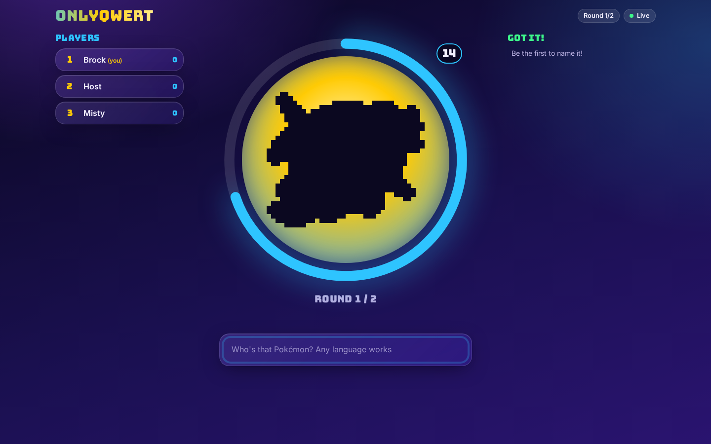
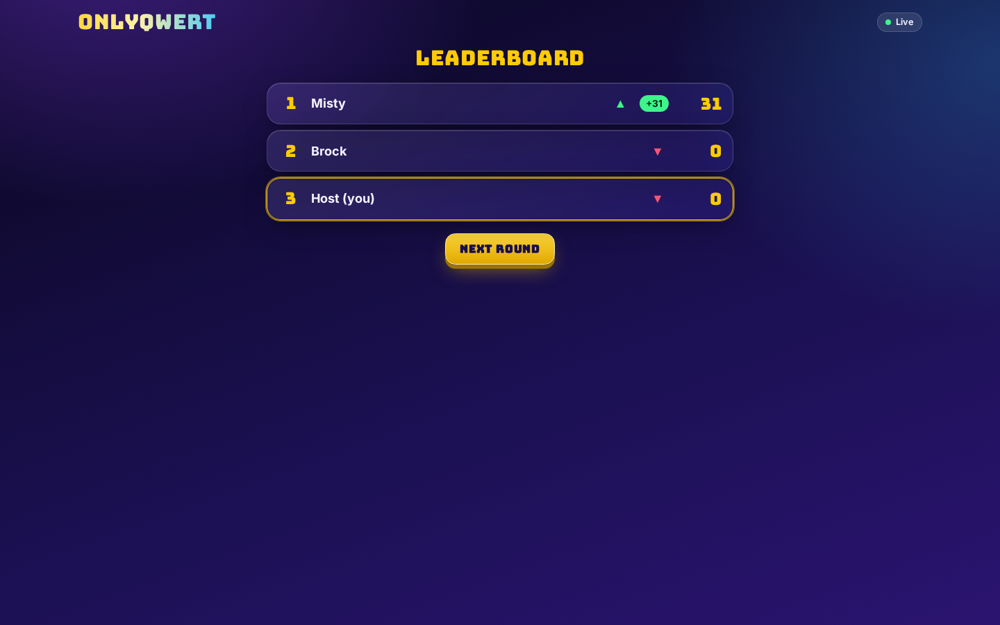
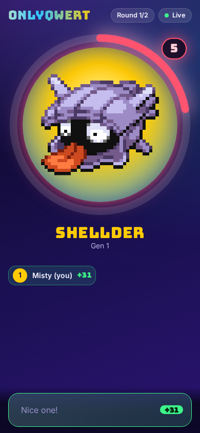
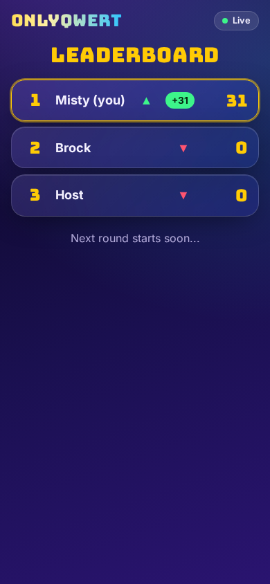

# onlyqwert

Games for streamers to play live with their community. A host creates a room, viewers join with a short code, and everybody plays together in real time.

The first game is **itspikachu**, a "Who's that Pokémon?" silhouette guessing game, served under `/itspikachu`.

## Screenshots

| Round (desktop) | Leaderboard (desktop) |
|---|---|
|  |  |

| Round (mobile) | Leaderboard (mobile) |
|---|---|
|  |  |

## Features

1. Rooms with a short, unambiguous 6 character code (case insensitive) and a join link.
2. Host settings: which generations (1 to 9), number of rounds, seconds per round. The host can optionally play too.
3. Every player sees the same silhouette mask of a Pokémon and a shared server driven countdown.
4. Live "got it!" feed: correct guessers pop up on every screen, one after the other.
5. Animated leaderboard after each round: score cards fly up and down to their new rank, and a podium at the end.
6. Scoring: 50 points for a correct guess plus up to 50 more depending on the time left (100 right at the start, 50 at the last moment).
7. Guesses are accepted in all languages (localized species names from PokeAPI, accents, case, punctuation and kana variants are normalized).
8. Anti cheat: opaque per round mask and sprite tokens, no Pokémon ids are ever sent to clients, wrong guesses are never broadcast, and the colored sprite is only revealed after the round or to a player who already guessed it correctly.
9. Reveal on your own correct guess: the guesser sees the real sprite immediately.
10. Host name: the host picks a display name when creating a room (default "Host"), and every player, host included, can rename themselves in the lobby.
11. Streamer mode (hide the room code behind a reveal button).
12. Responsive: designed for mobile and desktop, with a neon, glassy look and `prefers-reduced-motion` support.

## Tech stack

1. SvelteKit 3 with Svelte 5 (runes) and TypeScript.
2. Tailwind CSS v4 plus custom CSS files in `src/lib/styles/`.
3. Realtime via Server Sent Events, JSON endpoints for actions.
4. In memory room state (rooms are lost on restart).
5. `@sveltejs/adapter-node` for production.
6. Vitest (server and browser projects) and Playwright for tests.
7. `sharp` for sprite and mask processing.

## Requirements

1. Node.js 22 or newer (the asset scripts are run directly with `node script.ts`, which needs a Node version with TypeScript type stripping).
2. [pnpm](https://pnpm.io/) (the project is pnpm only, `engine-strict` is on).

## Getting started

```sh
pnpm install
pnpm dev
```

Then open the printed URL (by default http://localhost:5173) and go to `/itspikachu`. The repository already contains sprites and masks under `assets/`; you only need the asset pipeline below to regenerate them.

## Asset pipeline

Sprites and masks are deliberately kept in `assets/` (not in `static/`), so they can only be fetched through the token protected API endpoints.

| Command | What it does |
|---|---|
| `pnpm assets:download` | Downloads front sprites for national dex 1 to 1025 from PokeAPI/sprites into `assets/sprites/{id}.png` (`--force` to redownload). |
| `pnpm assets:data` | Builds `src/lib/data/pokemon.json` (id, name, generation, localized aliases) from the PokeAPI CSV data. |
| `pnpm assets:masks` | Trims sprites to their alpha bounds and generates solid silhouettes into `assets/masks/{id}.png`. |

Layout:

```
assets/
  sprites/   colored sprites, one {id}.png per Pokémon
  masks/     silhouettes, one {id}.png per Pokémon
src/lib/data/pokemon.json
```

## Scripts

| Script | Description |
|---|---|
| `pnpm dev` | Start the Vite dev server. |
| `pnpm build` | Production build (adapter-node, output in `build/`). |
| `pnpm preview` | Preview the production build. |
| `pnpm check` | `svelte-kit sync` and `svelte-check` type checking. |
| `pnpm check:watch` | Type checking in watch mode. |
| `pnpm test:unit` | Vitest in watch mode (add `--run` for a single run). |
| `pnpm test:server` | Server and endpoint Vitest specs, single run, no browser needed. |
| `pnpm test:e2e` | Install Playwright browsers and run the e2e tests. |
| `pnpm test` | Unit tests once, then e2e tests. |
| `pnpm assets:download` / `assets:data` / `assets:masks` | Asset pipeline, see above. |

## Testing

```sh
pnpm check                                  # types and Svelte diagnostics
pnpm test:server                            # server and endpoint unit tests (no browser needed)
pnpm test:unit --run                        # all Vitest projects (the client project needs Playwright Chromium)
pnpm test:e2e                               # Playwright e2e (builds the app and serves the preview on port 5511, override with E2E_PORT)
```

Server and endpoint specs live in `src/tests/` (`src/tests/api/*.test.ts` call the real `+server.ts` handlers through `src/tests/helpers.ts`), e2e specs are `*.e2e.ts` files next to the routes. `pnpm test:coverage` prints coverage for the server code.

## Production build and run

```sh
pnpm build
node build
```

The server listens on port 3000 by default. Set `PORT` (and optionally `HOST`) to change it:

```sh
PORT=8080 node build
```

Room state is held in memory in a single Node process, so run exactly one instance.

### Docker

A multi stage `Dockerfile` and `compose.yaml` are included (the image listens on port 3000; compose binds it to `127.0.0.1:3000` by default, override with `BIND`, `HOST_PORT` and `ORIGIN`):

```sh
docker compose up --build
```

## Project structure

```
assets/                  sprites and masks (private, served via tokens)
Dockerfile, compose.yaml  container build
docs/                    SPEC.md, BACKLOG.md, CREDITS.md, prs/, screenshots/
scripts/                 asset pipeline (download, data, masks)
src/lib/types.ts         shared contracts (settings, snapshot, SSE events)
src/lib/game/            name normalization and scoring (shared)
src/lib/server/          rooms, game state machine, guesses, tokens, SSE, masks, sprites
src/lib/client/          SSE backed room store
src/lib/components/      Svelte components (lobby, host, game, leaderboard)
src/lib/styles/          custom CSS (tokens, keyframes, glass, game)
src/lib/data/            pokemon.json
src/routes/              landing page, /itspikachu, /itspikachu/[code]
src/routes/api/rooms/    HTTP API
src/tests/               server side specs
```

## API overview

Full details, payloads and error codes are in [docs/SPEC.md](docs/SPEC.md) (section 6 for HTTP, section 7 for SSE events).

| Method and path | Purpose |
|---|---|
| `POST /api/rooms` | Create a room with settings and optional `hostName` (sets the host cookie). |
| `GET /api/rooms/[code]` | Room snapshot. |
| `POST /api/rooms/[code]/join` | Join with a nickname (sets the player cookie). |
| `PATCH /api/rooms/[code]/me` | Rename yourself in the lobby (unique, case insensitive). |
| `PATCH /api/rooms/[code]/settings` | Host: change generations, rounds, seconds. |
| `POST /api/rooms/[code]/start` | Host: start the game. |
| `POST /api/rooms/[code]/next` | Host: advance from the leaderboard. |
| `POST /api/rooms/[code]/restart` | Host: back to the lobby with scores reset. |
| `POST /api/rooms/[code]/kick` | Host: remove a player. |
| `POST /api/rooms/[code]/guess` | Player: submit a guess for the current round. |
| `GET /api/rooms/[code]/mask/[maskToken]` | Silhouette of the current round. |
| `GET /api/rooms/[code]/sprite/[spriteToken]` | Colored sprite, only after the round or after a correct guess. |
| `GET /api/rooms/[code]/events` | SSE stream with live room updates. |

## Development process

The project is built like a small SCRUM team: the backlog is in [docs/BACKLOG.md](docs/BACKLOG.md), every story lives on its own `feat/<slug>` branch in its own git worktree, and each change has a PR description in `docs/prs/NNN-<slug>.md` (summary, changes, test plan, review notes). A reviewer checks every PR before it is merged into `main` with `git merge --no-ff`.

## Credits and disclaimer

onlyqwert is a non commercial fan project. Pokémon and all related names and artwork are trademarks and copyrights of Nintendo, Game Freak and The Pokémon Company. This project is not affiliated with or endorsed by them. Sprites and species names come from [PokeAPI](https://github.com/PokeAPI). See [docs/CREDITS.md](docs/CREDITS.md) for details.
